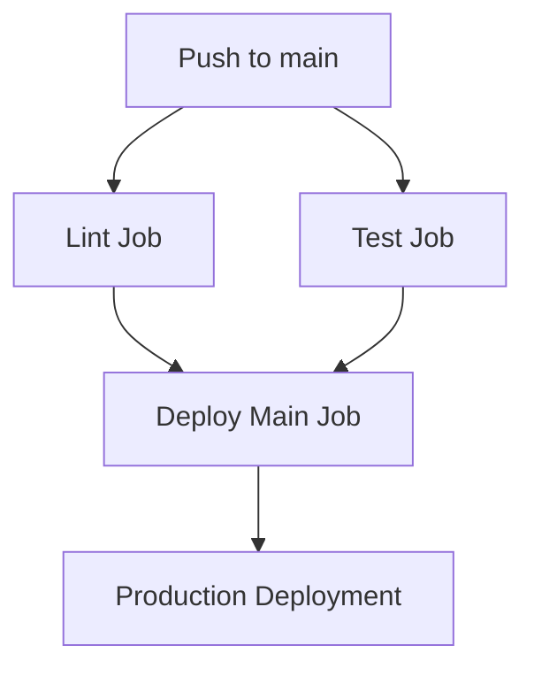
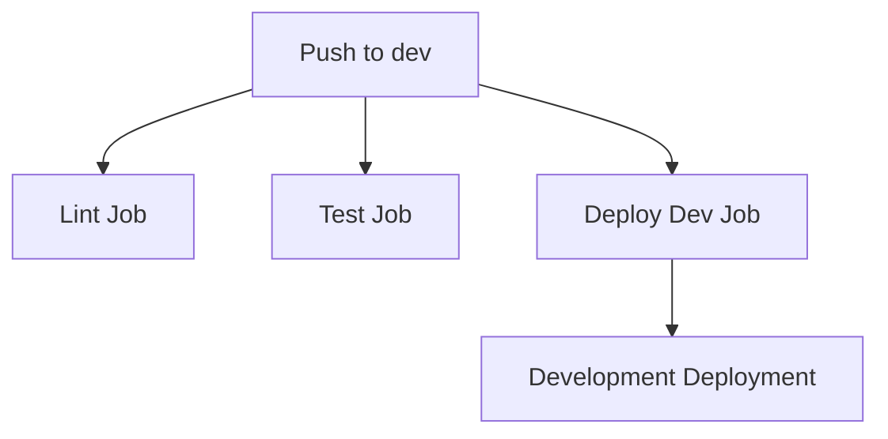

# GitHub Actions Workflows

This directory contains GitHub Actions workflows for automated deployment of the quotum-web application to Cloudflare Workers.

## Required Secrets and Variables

Before using these workflows, you need to set up the following in your GitHub repository:

### Cloudflare Configuration

1. **CLOUDFLARE_API_TOKEN** (Secret): Your Cloudflare API Token

   - Go to [Cloudflare API Tokens](https://dash.cloudflare.com/profile/api-tokens)
   - Create a token with the following permissions:
     - **Account**: `Cloudflare Workers:Edit`
     - **Zone**: `Zone Settings:Read, Zone:Read`
     - **Account**: `Account Settings:Read`

2. **CLOUDFLARE_ACCOUNT_ID** (Variable): Your Cloudflare Account ID
   - Found in your Cloudflare dashboard (right sidebar)
   - Set as a repository variable (not secret) since it's less sensitive

## Workflows

### 1. Unified Deployment (`deploy.yml`)

**Triggers:**

- Push to any branch (`*`)
- Pull requests to `main` and `dev` branches

**Jobs Structure:**

#### Lint Job (`lint`)

- **Always runs**: For all branches and PRs
- Runs ESLint and TypeScript checks in parallel
- Uses optimized caching for faster execution
- Independent execution - doesn't block other jobs

#### Test Job (`test`)

- **Always runs**: For all branches and PRs
- Runs complete test suite
- Parallel execution with lint job for maximum efficiency
- Independent execution - doesn't block other jobs

#### Deploy Main Job (`deploy-main`)

- **Only for `main` branch**: Strict quality gates
- **Requires**: Both lint and test jobs to pass first
- Deploys to production environment (`--env production`)
- Uses `build:opennext` command for optimized Cloudflare deployment

#### Deploy Dev Job (`deploy-dev`)

- **Only for `dev` branch**: Speed-optimized workflow
- **No dependencies**: Runs immediately without waiting for lint/test
- Deploys to development environment (`--env=development`)
- Prioritizes fast feedback for development workflow

**Environment Mapping:**

- `main` → `production` environment
- `dev` → `development` environment

**Key Features:**

- **Branch-specific deployment strategy**: Main requires quality gates, dev prioritizes speed
- **Parallel job execution**: Lint and test run simultaneously for efficiency
- **Automatic builds**: Uses `build:opennext` for Cloudflare Workers optimization
- **Environment isolation**: Production and development deployments are completely separate

## Custom Actions

The project includes three reusable custom actions to ensure consistency and reduce maintenance:

### 1. Setup Node.js (`/.github/actions/setup-node`)

**Purpose**: Standardized Node.js and package manager setup

**Features:**

- Reads Node.js version from `package.json` engines field
- Sets up Node.js with the exact specified version
- Enables corepack automatically for package manager compatibility
- Prepares package manager for immediate use

### 2. Setup pnpm Cache (`/.github/actions/setup-pnpm-cache`)

**Purpose**: Intelligent dependency caching with weekly expiration

**Features:**

- Gets pnpm store directory automatically
- Creates sophisticated cache keys with multiple factors
- Sets up hierarchical cache fallbacks for maximum hit rate
- Installs dependencies with `pnpm install --frozen-lockfile`

**Cache Key Format:**

```plaintext
pnpm-store-cache-{OS}-w{week_number}-lockfile-hash-{lock_hash}-pnpm{pnpm_version}-node{node_version}
```

**Example:**

```plaintext
pnpm-store-cache-ubuntu-latest-w2857-lockfile-hash-abc123def456-pnpm10.12.4-node22.15.0
```

### 3. Setup Build Cache (`/.github/actions/setup-build-cache`)

**Purpose**: Caches build tool intermediate results for faster builds

**Features:**

- Caches all `**/node_modules/.cache` directories
- Uses same intelligent caching strategy as pnpm cache
- Preserves build tool caches between runs
- Significantly speeds up subsequent builds

**Cached Tools Include:**

- **Next.js**: Build and page caches
- **TypeScript**: Compilation cache
- **ESLint**: Rule and result caches
- **Babel**: Transformation cache
- **Other build tools**: Various intermediate caches

**Cache Key Format:**

```plaintext
build-cache-{OS}-w{week_number}-lockfile-hash-{lock_hash}-pnpm{pnpm_version}-node{node_version}
```

**Example:**

```plaintext
build-cache-ubuntu-latest-w2857-lockfile-hash-abc123def456-pnpm10.12.4-node22.15.0
```

## Intelligent Caching Strategy

### Cache Key Priority (Most Important → Least Important)

1. **Cache Type**: Distinguishes between pnpm-store and build cache
2. **OS**: Platform isolation (Linux vs Windows vs macOS)
3. **Week Number**: **Forces weekly cache expiration**
4. **Lock Hash**: Immediate invalidation when dependencies change
5. **pnpm Version**: Package manager compatibility
6. **Node Version**: Runtime environment compatibility

### Weekly Expiration Benefits

- **Automatic freshness**: Caches automatically expire weekly
- **Security updates**: Ensures regular dependency security patches
- **Prevents corruption**: Eliminates long-term cache corruption issues
- **Consistent builds**: Regular full rebuilds ensure reproducibility

### Cache Fallback Strategy

```yaml
key: pnpm-store-cache-ubuntu-latest-w2857-lockfile-hash-abc123-pnpm10.12.4-node22.15.0

restore-keys:
  - pnpm-store-cache-ubuntu-latest-w2857-lockfile-hash-abc123- # Same deps, different versions
  - pnpm-store-cache-ubuntu-latest-w2857- # Same week, any deps
```

**Benefits:**

- **Maximum hit rate**: Tries progressively broader matches
- **Version flexibility**: Can reuse cache across compatible versions
- **Weekly isolation**: Never falls back to previous weeks

## Job Execution Flow

### Optimized for Different Branches

**Main Branch (Production-Ready):**



**Dev Branch (Speed-Optimized):**



### Step-by-Step Execution

Each job follows this optimized sequence:

1. **Checkout**: Get latest code
2. **Setup Node.js**: Configure runtime environment
3. **Setup Build Cache**: Restore build tool caches
4. **Setup pnpm Cache**: Restore dependencies and install
5. **Execute**: Run job-specific tasks (lint/test/build/deploy)

## Version Management

**Centralized Configuration**: All version information is read from the root `package.json`:

```json
{
  "engines": {
    "node": "22.15.0",
    "pnpm": "10.12.4"
  },
  "packageManager": "pnpm@10.12.4"
}
```

**Corepack Benefits:**

- **Automatic detection**: Reads version from `packageManager` field
- **Zero configuration**: No manual pnpm installation needed
- **Version consistency**: Same version across all environments
- **Easy updates**: Change version in one place, applies everywhere

## Environment Configuration

The `wrangler.toml` file defines environment-specific worker configurations:

```toml
[env.production]
name = "production"

[env.development]
name = "development"
```

## Deployment URLs

Your deployed applications will be available at:

- **Production**: `https://production.your-workers-subdomain.workers.dev`
- **Development**: `https://development.your-workers-subdomain.workers.dev`

## Performance Optimizations

1. **Parallel Execution**: Lint and test jobs run simultaneously
2. **Intelligent Caching**: Multi-layer cache strategy with weekly expiration
3. **Build Cache**: Preserves expensive build tool results
4. **Branch Strategy**: Dev branch deploys immediately for fast feedback
5. **Optimized Dependencies**: Frozen lockfile prevents version drift

## Security & Quality

- **Secrets Management**: API tokens stored securely as GitHub secrets
- **Quality Gates**: Main branch requires passing tests and linting
- **Environment Isolation**: Production and development completely separated
- **Official Actions**: Uses only official Cloudflare and GitHub actions

## Troubleshooting

1. **Deployment Fails**:

   - Verify `CLOUDFLARE_API_TOKEN` secret is set correctly
   - Check `CLOUDFLARE_ACCOUNT_ID` variable matches your account

2. **Build Errors**:

   - Ensure project builds locally with `pnpm run build:opennext`
   - Check Node.js version matches `package.json` engines

3. **Cache Issues**:

   - Weekly expiration automatically resolves most cache problems
   - Manual cache clearing available through GitHub Actions interface

4. **Permission Errors**:
   - Verify API token has `Cloudflare Workers:Edit` permission
   - Ensure account ID corresponds to the correct Cloudflare account

## Customization

Customize the workflows by:

- **Adding environments**: Update `wrangler.toml` with new environment configs
- **Changing branches**: Modify job conditions in `deploy.yml`
- **Adjusting caching**: Modify cache keys in custom actions
- **Version updates**: Change versions in root `package.json`
- **Additional steps**: Add custom build or deployment steps as needed
